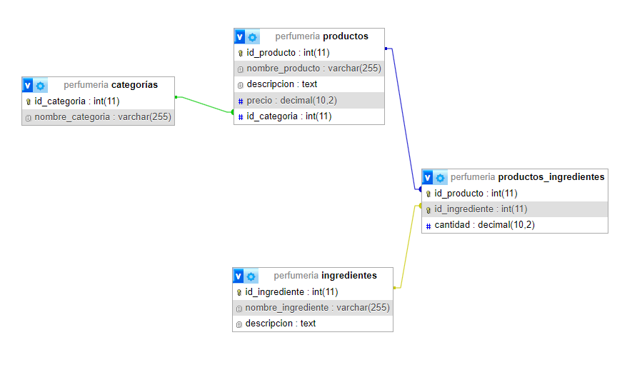

# Base de Datos de Perfumería

## Descripción del Dominio

Este proyecto diseña una base de datos para una tienda de perfumería, con el objetivo de almacenar información sobre categorías de productos, productos individuales, ingredientes utilizados en los productos y la relación entre productos e ingredientes.

## Diagrama de la Base de Datos

## Estructura de la Base de Datos

### Tablas

- **Categorías**: Almacena las categorías de perfumes.
- **Productos**: Almacena los productos de perfumería.
- **Ingredientes**: Almacena los ingredientes de los productos.
- **Productos_Ingredientes**: Relaciona productos con ingredientes y almacena la cantidad de cada ingrediente en un producto.

### Relaciones

- Una **Categoría** puede tener muchos **Productos** (1:N).
- Un **Producto** puede tener muchos **Ingredientes** y un **Ingrediente** puede estar en muchos **Productos** (N:M).

## Archivos 

- `database.sql`: Script SQL para crear la base de datos e insertar datos de ejemplo.
- `DbDiagram.png`: Diagrama de la base de datos.
